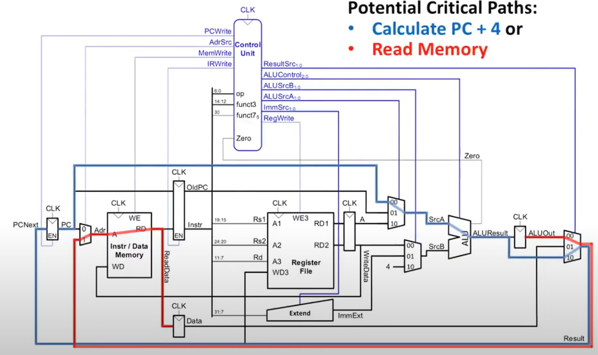
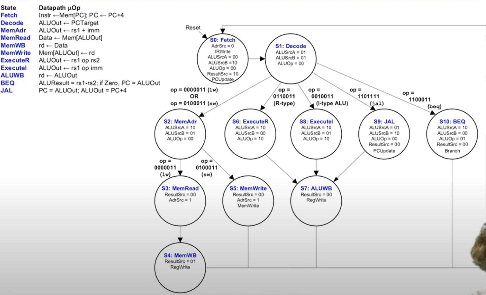
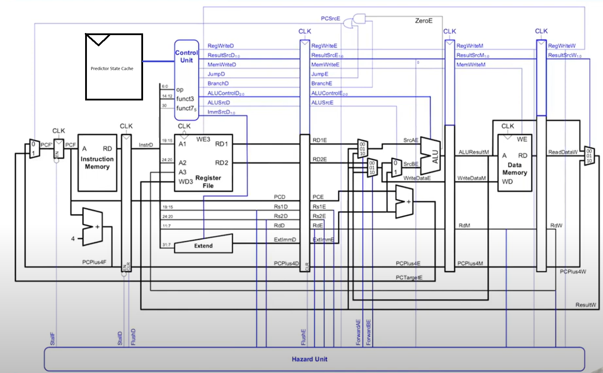

# lab 2-1 实验报告
## 框架说明
### 项目构建
#### 根Makefile
将`make T=name`分发到子目录分别构建Simulator和Test. 将T=name传递到test构建对应的测试用例

最后使用simulator执行对应的构建好的测试(.bin)
#### Simulator
使用Makefile将所有的C源文件编译为目标文件(.o),然后链接所有目标文件为可执行文件simulator
#### Test
接收根Makefile传递的TARGET，推导依赖关系构建出对应的目标文件(.o), 其中除了target对应对的目标文件还有start.o和trm.o作为通用的abi接口，将三个目标文件依据linker.ld链接为ELF,最后再利用工具生成对应的二进制文件(.bin),并提供易于检查的文本格式的汇编代码(.txt).

## 模拟器执行逻辑
模拟器使用指令级模拟，将riscv体系结构的程序员可见状态保存在数据结构(`CPU_state`, `mem`)中，如pc、寄存器、内存等

模拟器每次依据pc从指令内存中取出指令，解码并依据指令修改程序员可见状态，更新pc，直到遇到结束指令或异常指令。

其中解码部分采用了嵌套宏构建的字符串匹配器，依次从上到下匹配指令类型并执行第一个匹配的指令的操作。

## 功能测试与报告
### 基础功能
通过了基础功能测试用例.
运行:

`./driver`

输出:

```
Checking Denpendencies...
Build Simulator...
Simulator building finished.
Processing: ackermann
Success
Processing: add
Success
Processing: div
Success
Processing: dummy
Success
Processing: if-else
Success
Processing: load-store
Success
Processing: matrix-mul
Success
Processing: puts
Success
Processing: quicksort
Success
Processing: shift
Success
Processing: unalign
Success
Score: 11/11
```

### 2.Debug支持
运行:

`make T=dummy MODE=debug`

输出:

```
-------Build Simulator-------
make[1]: Entering directory '/workspaces/Workspace/lab2_1/simulator/sim'
make[1]: Nothing to be done for 'all'.
make[1]: Leaving directory '/workspaces/Workspace/lab2_1/simulator/sim'
-------Build Test-------
make[1]: Entering directory '/workspaces/Workspace/lab2_1/simulator/test'
make[1]: Nothing to be done for 'all'.
make[1]: Leaving directory '/workspaces/Workspace/lab2_1/simulator/test'
-------Start Simulation-------
[INFO] (src/memory.c:74) Physical Memory Range:[0000000008000000, 000000000fffffff].
[INFO] (src/memory.c:80) The image is test/build/dummy.bin, size = 176.
help: print this help message
c: continue the stopped program
q: exit the simulator
si [N]: single step N times (default 1)
info r: print register status
b ADDR(Hex): set a breakpoint at ADDR
d: delete all breakpointsx N ADDR(Hex): print 4N bytes at ADDR of the memory. Show in little endian
> 
```

可以按照help中的提示进行调试，除了要求外还实现了断点功能配合continue.

### 附加功能
#### 断点功能

输出
```
[INFO] (src/memory.c:74) Physical Memory Range:[0000000008000000, 000000000fffffff].
[INFO] (src/memory.c:80) The image is test/build/load-store.bin, size = 936.
help: print this help message
c: continue the stopped program
q: exit the simulator
si [N]: single step N times (default 1)
info r: print register status
b ADDR(Hex): set a breakpoint at ADDR
d: delete all breakpointsx N ADDR(Hex): print 4N bytes at ADDR of the memory. Show in little endian
> b 0x80000f4
[WARN] (src/monitor.c:211: errno: None) Adding 0x00000000080000f4 breakpoint succeeded.
> c
[INFO] (src/monitor.c:234) Hit breakpoints 0x00000000080000f4.
> info r
PC  : 0x00000000080000f4
x0  : 0x0000000000000000        x1  : 0x00000000080000c0
x2  : 0x0000000008008fc0        x3  : 0x0000000000000000
x4  : 0x0000000000000000        x5  : 0x0000000000000000
x6  : 0x0000000000000000        x7  : 0x0000000000000000
x8  : 0x0000000008008fe0        x9  : 0x0000000000000000
x10 : 0x0000000000000001        x11 : 0x0000000000000000
x12 : 0x0000000000000000        x13 : 0xffffffffffffffff
x14 : 0x0000000008000318        x15 : 0x0000000000000000
x16 : 0x0000000000000000        x17 : 0x0000000000000000
x18 : 0x0000000000000000        x19 : 0x0000000000000000
x20 : 0x0000000000000000        x21 : 0x0000000000000000
x22 : 0x0000000000000000        x23 : 0x0000000000000000
x24 : 0x0000000000000000        x25 : 0x0000000000000000
x26 : 0x0000000000000000        x27 : 0x0000000000000000
x28 : 0x0000000000000000        x29 : 0x0000000000000000
x30 : 0x0000000000000000        x31 : 0x0000000000000000
> 
```
#### 支持全部RV64IM指令集
#### 支持系统调用(puts)
处理方式是转发rv64中的ecall指令到x86的syscall指令, 使用`unistd.h`作为外部系统调用接口。不直接使用syscall的考虑是:
1. 直接插入syscall不够方便，同时语义不明确
2. 插入x86 syscall汇编会降低跨平台的可移植性
3. 自己包装x86 syscall会增加代码复杂度, 并且做的事和标准C库同样的事情意义不大

运行:

`make T=puts`

输出:
```
-------Build Simulator-------
make[1]: Entering directory '/workspaces/Workspace/lab2_1/simulator/sim'
make[1]: Nothing to be done for 'all'.
make[1]: Leaving directory '/workspaces/Workspace/lab2_1/simulator/sim'
-------Build Test-------
make[1]: Entering directory '/workspaces/Workspace/lab2_1/simulator/test'
make[1]: Nothing to be done for 'all'.
make[1]: Leaving directory '/workspaces/Workspace/lab2_1/simulator/test'
-------Start Simulation-------
[INFO] (src/memory.c:74) Physical Memory Range:[0000000008000000, 000000000fffffff].
[INFO] (src/memory.c:80) The image is test/build/puts.bin, size = 17360.
Hello, World!
HIT GOOD TRAP!
[INFO] (src/cpu.c:33) Program ended at pc 080000a0, with exit code 0.
```

#### 实现了memtrace功能
运行:

```
make T=dummy MEM_TRACE=ON
cat memtrace.out
```

输出:

```
-------Start Simulation-------
[INFO] (src/memory.c:98) Physical Memory Range:[0000000008000000, 000000000fffffff].
[INFO] (src/memory.c:104) The image is test/build/dummy.bin, size = 176.
HIT GOOD TRAP!
[INFO] (src/cpu.c:33) Program ended at pc 0800004c, with exit code 0.
make: use "cat memtrace.out" to check the memtrace.
root@de5656b9e044:/workspaces/Workspace/lab2_1/simulator# cat memtrace.out
w 0x0000000008008ff8 8 0000000008000010
w 0x0000000008008ff0 8 0000000000000000
w 0x0000000008008fd8 8 0000000008009000
r 0x0000000008008fd8 8 0000000008009000
w 0x0000000008008fec 4 00000000
r 0x0000000008008fec 4 00000000
w 0x0000000008008fd8 8 0000000008009000
w 0x0000000008008fcc 4 00000000
r 0x0000000008008fcc 4 00000000
```

# lab2-2 实验报告
# 计算机组织与系统结构实习报告 Lab 2.2
学号：2200013093

姓名：张佳豪

大班教师：陆俊林


---
## Part I：RISC-V 多周期模拟器 （50分）
### 基于实现的RISC-V  ISA，给出指令各阶段的寄存器传输级描述 （10分）。每类指令举1-2个例子即可
#### R
add rd, rs1, rs2  

| 阶段   | 操作描述                                                                  
|--------|--------------------------------------------------------------------------
| 取指   | `IR <- imem[PC]`，`NPC <- PC + 4`  
| 译码   | `opcode=0x33`，`func3=0x0`，`func7=0x00`；`raddr1=IR[19:15]`，`raddr2=IR[24:20]` , `waddr=IR[11:7]`
| 执行   | `ALUOut <- rs1 + rs2`          
| 访存   |  空                                                         
| 写回   | `RegFile[rd] <- ALUOut`，`PC <- NPC`                                 

#### I
ld rd, offset(rs1)  

| 阶段   | 操作描述                                                                  
|--------|--------------------------------------------------------------------------
| 取指   | `IR <- imem[PC]`，`NPC <- PC + 4`                            
| 译码   | `imm=SignExtend(IR[31:20])`，`raddr1=IR[19:15]` ,`waddr=IR[11:7]`         
| 执行   | `ALUOut <- rs1 + imm`                                 
| 访存   | `LMD <- dmem[ALUOut]_64`                
| 写回   | `RegFile[rd] <- LMD`，`PC <- NPC`      


#### S
sd rs2, offset(rs1)  

| 阶段   | 操作描述                                                                  
|--------|--------------------------------------------------------------------------
| 取指   | `IR <- imem[PC]`，`NPC <- PC + 4`                                        
| 译码   | `imm=SignExtend({IR[31:25], IR[11:7]})`，`raddr1=IR[19:15]` ,`raddr2=IR[24:20]`          
| 执行   | `ALUOut <- rs1 + imm`                                                      
| 访存   | `dmem[ALUOut]_64 <- rs2`            
| 写回   | `PC <- NPC`                                                             


#### SB
beq rs1, rs2, offset  

| 阶段   | 操作描述                                                                  
|--------|--------------------------------------------------------------------------
| 取指   | `IR <- imem[PC]`，`NPC <- PC + 4`                                        
| 译码   | `imm=SignExtend({IR[31], IR[7], IR[30:25], IR[11:8]}) << 1`, `raddr1=IR[19:15]` ,`raddr2=IR[24:20]`
| 执行   | `ALUOut <- PC + imm`                
| 访存   | 空                                           
| 写回   | `PC <- (rs1 == rs2) ? ALUOut : NPC`

#### U
auipc rd, offset  

| 阶段   | 操作描述                                                                  
|--------|--------------------------------------------------------------------------
| 取指   | `IR <- imem[PC]`，`NPC <- PC + 4`                                        
| 译码   | `imm=IR[31:12] << 12`, `waddr=IR[11:7]`                        
| 执行   | `ALUOut <- PC + imm`     
| 访存   | 空                                               
| 写回   | `RegFile[rd] <- ALUOut`，`PC <- NPC`

#### UJ
jal rd, offset  

| 阶段   | 操作描述                                                                  
|--------|--------------------------------------------------------------------------
| 取指   | `IR <- imem[PC]`，`NPC <- PC + 4`                                        
| 译码   | `imm=SignExtend({IR[31], IR[19:12], IR[20], IR[30:21]}) << 1`, `waddr=IR[11:7]`
| 执行   | `ALUOut <- PC + imm`                     
| 访存   | 空                                                                                      
| 写回   | `RegFile[rd] <- NPC`，`PC <- ALUOut`


###  基于以上分析，给出多周期处理器的数据通路图和控制信号产生逻辑。不限形式，手绘也可。 （10分）
> 为确保正确性，数据通路图和控制信号产生逻辑均使用了[DDCA Ch7](https://www.youtube.com/watch?v=lrN-uBKooRY&list=PLhA3DoZr6boVQy9Pz-aPZLH-rA6DvUidB)的设计
> 此外不一定和上一问保持一致，比如PC可在在S0一个phase更新，因为设计中有直接的数据通路。

数据通路:


控制信号:



###  运行测试程序，给出动态执行的指令数。 （共5个定点程序，每个2分）
###  运行测试程序，给出多周期处理器的执行周期数，并计算平均CPI。 （共5个定点程序，每个4分）
> 由于在lab2-1中修改了起始地址为0x08000000, 因此使用源代码编译测试，而不直接使用二进制程序

这一部分的模拟器实现只需要预先保存一个表格记录每个指令所需的周期，然后执行过程中累加即可。
特殊处理为div和rem连续的情况，测试程序保存上一条指令进行特判。

运行测试程序的命令为：
```bash
./driver.sh --perf multicycle -E "lab2"
```

结果
```bash
Checking Dependencies...
Build Simulator...
Simulator building finished.
Processing: lab2-2-1
Success
Performance Metrics:
  Performance Profiler: Multicycle
  Dynamic instructions: 74
  Dynamic cycles: 305
  CPI: 4.12
Processing: lab2-2-10
Success
Performance Metrics:
  Performance Profiler: Multicycle
  Dynamic instructions: 64
  Dynamic cycles: 303
  CPI: 4.73
Processing: lab2-2-2
Success
Performance Metrics:
  Performance Profiler: Multicycle
  Dynamic instructions: 74
  Dynamic cycles: 305
  CPI: 4.12
Processing: lab2-2-3
Success
Performance Metrics:
  Performance Profiler: Multicycle
  Dynamic instructions: 149
  Dynamic cycles: 620
  CPI: 4.16
Processing: lab2-2-4
Success
Performance Metrics:
  Performance Profiler: Multicycle
  Dynamic instructions: 209
  Dynamic cycles: 875
  CPI: 4.19
Processing: lab2-2-5
Success
Performance Metrics:
  Performance Profiler: Multicycle
  Dynamic instructions: 150
  Dynamic cycles: 819
  CPI: 5.46
Processing: lab2-2-6
Success
Performance Metrics:
  Performance Profiler: Multicycle
  Dynamic instructions: 110
  Dynamic cycles: 649
  CPI: 5.90
Processing: lab2-2-7
Success
Performance Metrics:
  Performance Profiler: Multicycle
  Dynamic instructions: 179
  Dynamic cycles: 745
  CPI: 4.16
Processing: lab2-2-8
Success
Performance Metrics:
  Performance Profiler: Multicycle
  Dynamic instructions: 106
  Dynamic cycles: 434
  CPI: 4.09
Processing: lab2-2-9
Success
Performance Metrics:
  Performance Profiler: Multicycle
  Dynamic instructions: 74
  Dynamic cycles: 344
  CPI: 4.65

Score: 10/10 (filtered: 'lab2')
```

## Part II：RISC-V 流水线模拟器（50分）
### 基于实现的RISC-V ISA，给定流水线处理器的阶段划分，并简单介绍各阶段的工作。 （5分）
> Part II的设计参考《Computer Architecture A Quantitative Approach》
五级划分IF, ID, EX, MEM, WB.

1. IF
从imem中读取IR，更新PC
2. ID
解码，读取寄存器文件，符号拓展立即数
3. EX
ALU选择输入执行运算
4. MEM
读/写内存
5. WB
写寄存器文件

[pipeline_stages](assets/pipline_stages.png)


### 给出流水线处理器的数据通路图和控制信号产生逻辑。不限形式，手绘也可。 （5分）
> 为确保正确性，数据通路图和控制信号产生逻辑均使用了[DDCA Ch7](https://www.youtube.com/watch?v=lrN-uBKooRY&list=PLhA3DoZr6boVQy9Pz-aPZLH-rA6DvUidB)的设计
[pipeline](assets/pipline.png)
控制信号产生具体的布尔逻辑由op，func3,func7共同决定。

### 请简要描述该流水线中会产生的各种冒险，每类均需举例说明。 （10分）
#### 数据冒险
1. ALU类
```asm
add x1, x2, x3
sub x4, x1, x5
```
stall两个周期
2. load/use类
```asm
ld x1, 0(x2)
add x3, x1, x4
```
stall两个周期
3. jalr PC寄存器数据冒险
```asm
jalr x1, 0(x2)
add x3, x4, x5
```
jalr指令需要stall两个周期，等待ALUOut的结果前递到IF/ID流水寄存器(前递数据通路未在上一问画出)


#### 控制冒险
```asm
beq x1, x2, target
add x3, x4, x5
```
总是不跳转预测错误需要清空错误预取的2条指令(同时也是数据冒险，因为上一问架构中跳转地址计算在EX阶段完成并前递)

#### 其他stall
```asm
div x1, x2, x3
add x4, x5, x6
```
ALU进行除法操作时不可流水造成的39个周期的stall.(因为是顺序处理器)

> 当div，rem可共用结果时，rem等同于一般流水指令

```asm
mul x1, x2, x3
add x4, x1, x5
```
ALU进行64位乘法操作时造成的1个周期的stall.(因为是顺序处理器)


### 运行测试程序，给出流水线处理器的执行周期数，并计算平均CPI。 （共5个测试程序，每个4分）
### 请对该流水线处理器中因不同类型的冒险而发生的停顿进行统计，并打印数据和分析。 （共5个测试程序，每个2分）
采用模拟流水线的方法.
> 其它stall不统计(但是产生效果)
> 总周期以最后一条指令出流水线为记

运行测试程序的命令为：
```bash
./driver.sh --perf pipeline -E "lab2"
```

结果
```bash
Checking Dependencies...
Build Simulator...
Simulator building finished.
Processing: lab2-2-1
Success
Performance Metrics:
  Performance Profiler: Pipeline
  Dynamic instructions: 74
  Dynamic cycles: 156
  CPI: 2.11
  Control Hazard Stall Cycles: 0
  Data Hazard Stall Cycles: 78

Processing: lab2-2-10
Success
Performance Metrics:
  Performance Profiler: Pipeline
  Dynamic instructions: 64
  Dynamic cycles: 171
  CPI: 2.67
  Control Hazard Stall Cycles: 0
  Data Hazard Stall Cycles: 64

Processing: lab2-2-2
Success
Performance Metrics:
  Performance Profiler: Pipeline
  Dynamic instructions: 74
  Dynamic cycles: 156
  CPI: 2.11
  Control Hazard Stall Cycles: 0
  Data Hazard Stall Cycles: 78

Processing: lab2-2-3
Success
Performance Metrics:
  Performance Profiler: Pipeline
  Dynamic instructions: 149
  Dynamic cycles: 322
  CPI: 2.16
  Control Hazard Stall Cycles: 10
  Data Hazard Stall Cycles: 159

Processing: lab2-2-4
Success
Performance Metrics:
  Performance Profiler: Pipeline
  Dynamic instructions: 209
  Dynamic cycles: 462
  CPI: 2.21
  Control Hazard Stall Cycles: 10
  Data Hazard Stall Cycles: 239

Processing: lab2-2-5
Success
Performance Metrics:
  Performance Profiler: Pipeline
  Dynamic instructions: 150
  Dynamic cycles: 520
  CPI: 3.47
  Control Hazard Stall Cycles: 10
  Data Hazard Stall Cycles: 161

Processing: lab2-2-6
Success
Performance Metrics:
  Performance Profiler: Pipeline
  Dynamic instructions: 110
  Dynamic cycles: 432
  CPI: 3.93
  Control Hazard Stall Cycles: 10
  Data Hazard Stall Cycles: 113

Processing: lab2-2-7
Success
Performance Metrics:
  Performance Profiler: Pipeline
  Dynamic instructions: 179
  Dynamic cycles: 392
  CPI: 2.19
  Control Hazard Stall Cycles: 10
  Data Hazard Stall Cycles: 199

Processing: lab2-2-8
Success
Performance Metrics:
  Performance Profiler: Pipeline
  Dynamic instructions: 106
  Dynamic cycles: 242
  CPI: 2.28
  Control Hazard Stall Cycles: 0
  Data Hazard Stall Cycles: 132

Processing: lab2-2-9
Success
Performance Metrics:
  Performance Profiler: Pipeline
  Dynamic instructions: 74
  Dynamic cycles: 185
  CPI: 2.50
  Control Hazard Stall Cycles: 0
  Data Hazard Stall Cycles: 68


Score: 10/10 (filtered: 'lab2')
```

分析:
结果CPI距离理想CPI 1有不少距离。
结果主要由测试程序的性质决定，control stalls基本等于循环数*2, 但是测试程序普遍有较强数据依赖，所以data hazard的stall数目较多。

## Part III：其他加分
### 实现2bit 4096 entry 动态分支预测。
数据通路部分需要加一个预测状态表，由control unit进行读写，control unit增添和状态表关联的对PcSrcE的控制逻辑

> 预测状态表采取PC的13:2位作为索引，直接映射无组相联
> 没有命中时默认是weak的向低处跳转
> 同时增加数据的前递逻辑，消除ALU类指令的数据冒险，将load/use类指令的stall数目减少到1个周期,同时将jalr数据前递到IF，减少stall数目到1





